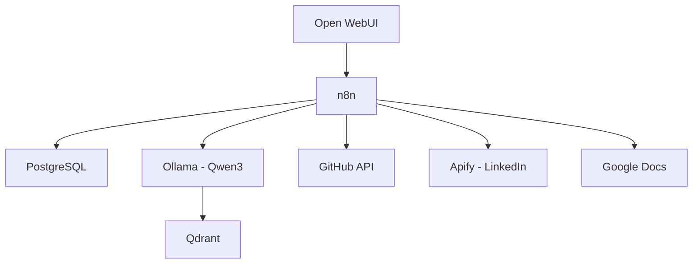

# 🚀 CV-AIntelligent: Generador de CV Inteligente y Automatizado

Sistema de automatización basado en **n8n** que genera currículums altamente personalizados y optimizados para ofertas laborales específicas. Actúa como un "Reclutador Técnico IA" que analiza tu perfil en **LinkedIn** y tu actividad técnica en **GitHub** para alinear tu propuesta de valor con los requisitos de una vacante.

> [!NOTE]
> Este proyecto está basado en el [Self-Hosted AI Starter Kit](https://github.com/n8n-io/self-hosted-ai-starter-kit/blob/main/README.md) de n8n. Consulta la documentación oficial para más detalles sobre la configuración base.

---

## 📋 Características Principales

- **Extracción Inteligente de Datos**: Obtiene información de LinkedIn (via Apify) y GitHub automáticamente
- **Persistencia de Perfil**: Almacena y cachea tu perfil técnico en PostgreSQL
- **IA Local**: Usa Ollama (Qwen3 8b) para procesamiento local y ahorro de costos
- **Generación de CV**: Crea documentos personalizados en Google Docs
- **Interfaz de Chat**: Interacción mediante Open WebUI

---

## 🏗️ Arquitectura del Sistema



---

## 🛠️ Stack Tecnológico

| Componente | Descripción | Puerto |
|------------|-------------|--------|
| **n8n** | Orquestador de workflows | `5678` |
| **PostgreSQL** | Base de datos principal | `5432` |
| **Ollama** | Motor de IA local | `11434` |
| **Open WebUI** | Interfaz de usuario | `3000` |
| **Qdrant** | Base de datos vectorial | `6333` |
| **Flowise** | Constructor visual de IA | `3001` |

---

## 🚀 Inicio Rápido

### Prerrequisitos

- Docker y Docker Compose instalados
- Git

### Instalación

1. **Clona el repositorio:**
   ```bash
   git clone https://github.com/Juliotamara23/CV-AIntelligent.git
   cd CV-AIntelligent
   ```

2. **Configura las variables de entorno:**
   ```bash
   cp .env.example .env
   # Edita .env con tus credenciales
   ```

3. **Inicia los servicios:**

   **Para CPU:**
   ```bash
   docker compose --profile cpu up -d
   ```

   **Para GPU (NVIDIA):**
   ```bash
   docker compose --profile gpu-nvidia up -d
   ```


> [!NOTE] 
> Si es la primera vez que usas Ollama con Docker, puedes revisar el siguiente enlace: https://docs.ollama.com/docker


1. **Accede a las interfaces:**
   - **n8n**: http://localhost:5678
   - **Open WebUI**: http://localhost:3000
   - **Flowise**: http://localhost:3001

---

## 📊 Flujo de Trabajo

1. **Identificación**: El sistema detecta el `user_id` desde Open WebUI
2. **Onboarding**: Si es nuevo usuario, solicita URLs de GitHub y LinkedIn
3. **Sincronización**: Extrae y almacena datos en PostgreSQL
4. **Análisis**: Recibe oferta laboral y hace match con tu perfil
5. **Generación**: Crea CV personalizado en Google Docs
6. **Entrega**: Envía enlace del documento final

---

## 🔧 Configuración

### Variables de Entorno Requeridas

```env
POSTGRES_USER=tu_usuario
POSTGRES_PASSWORD=tu_contraseña
POSTGRES_DB=n8n
N8N_ENCRYPTION_KEY=tu_clave_encriptacion
N8N_USER_MANAGEMENT_JWT_SECRET=tu_jwt_secret
```

---

## 📁 Estructura del Proyecto

```
CV-AIntelligent/
├── docker-compose.yml    # Configuración de servicios
├── n8n/
│   └── backup/           # Workflows y credenciales
├── shared/               # Datos compartidos
├── plan.md              # Plan del proyecto
├── tareas.md            # Lista de tareas
└── README.md            # Este archivo
```

---

## 📚 Documentación de Referencia

- [Self-Hosted AI Starter Kit (Documentación Oficial)](https://github.com/n8n-io/self-hosted-ai-starter-kit/blob/main/README.md)
- [Documentación de n8n](https://docs.n8n.io/)
- [Ollama](https://ollama.ai/)
- [Open WebUI](https://github.com/open-webui/open-webui)

---

## 📄 Licencia

Este proyecto está licenciado bajo la Licencia Apache 2.0. Consulta el archivo [LICENSE](LICENSE) para más detalles.
